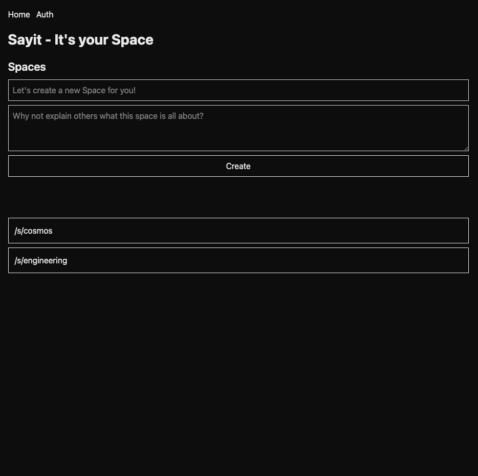
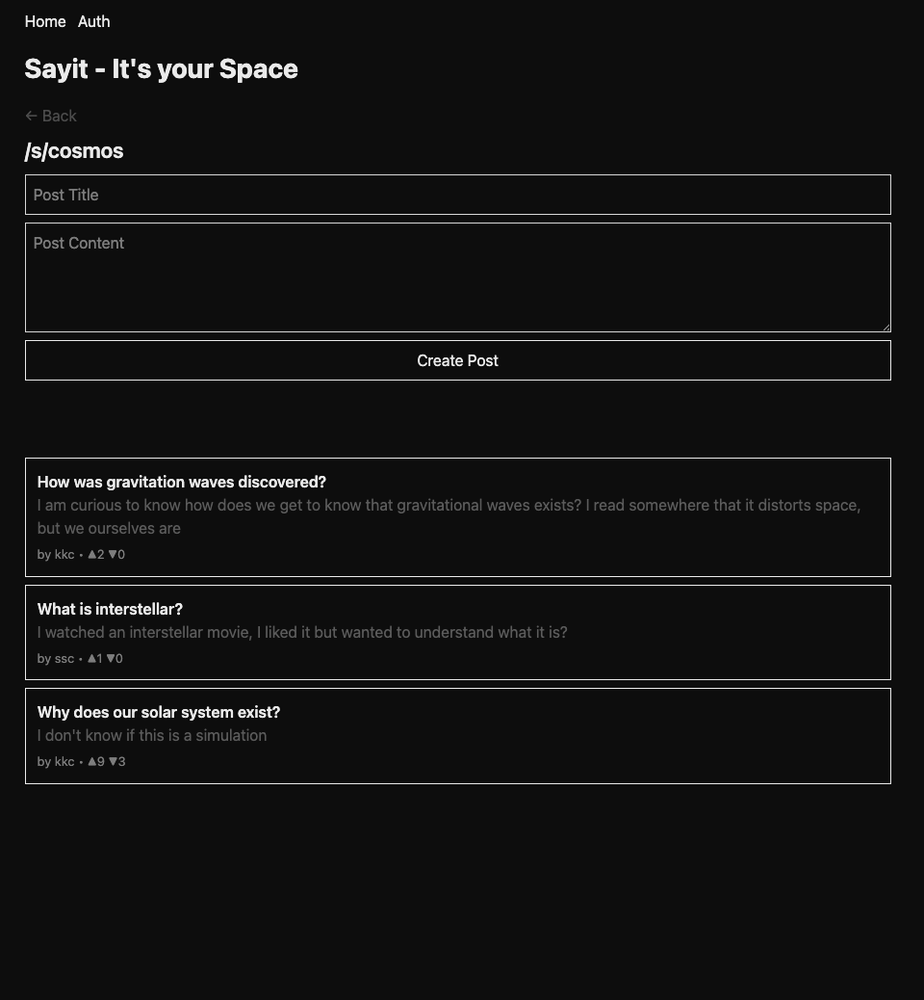
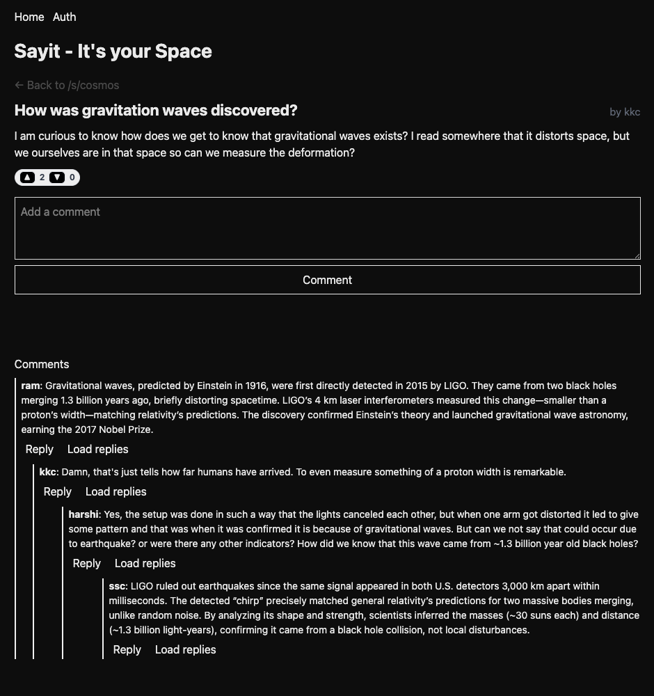

This is a [Next.js](https://nextjs.org) project bootstrapped with [
`create-next-app`](https://nextjs.org/docs/app/api-reference/cli/create-next-app).

## SayIt - It's your Space

SayIt is a reddit like application where one can create spaces similar to subreddit and posts, we also support nested
comments.
This repo is its frontend, its backend is managed in a separate repo and uses
springboot [sayit-backend](https://github.com/confusedconsciousness/sayit).

Here is how it looks like

HomePage


SpacePage


PostPage


To run, first, run the development server:

```bash
npm run dev
# or
yarn dev
# or
pnpm dev
# or
bun dev
```

Open [http://localhost:3000](http://localhost:3000) with your browser to see the result.

